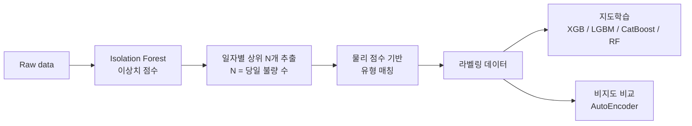

# A 방식 : raw data에 대한 임의의 라벨링이 필요하다

## 개요
원본 데이터에는 타점별 불량 라벨이 없고, `result.csv`에 **일자별 불량 개수·유형**만 존재한다.
이를 타점 단위로 복원(의사 라벨링)한 뒤 지도학습으로 불량을 예측하는 접근이다.



## 파일 구성
| 파일 | 설명 |
|---|---|
| `Welding Data Set_01_Raw_data.csv` | 원본 공정 데이터 (두께, 가압력, 전류, 전압, 통전시간) |
| `Welding Data Set_01_result.csv` | 일자별 불량 개수 및 유형 (원본) |
| `pipeline.py` | 의사 라벨 생성 → 모델 학습·비교 |
| `Welding_Data_Set_01_defect.csv` | 불량으로 할당된 타점 39건 (Type1 14 / Type2 13 / Type3 12) |
| `pca_weights.py` | 불량 타점 4개 변수 PCA 로딩 계산 |
| `cluster_visualization.png` | PCA 2차원 불량 유형 분포 |

## 라벨링 규칙
1. Isolation Forest의 `decision_function` 점수로 당일 가장 이상한 타점 N개 선정
2. 유형별 물리 점수(표준화 변수 합)를 정의하고, 헝가리안 알고리즘으로 타점–유형을 매칭

| 유형 | 물리 점수 가정 |
|---|---|
| Type 1 파임불량 | 가압력↑ + 전압↑ |
| Type 2 용접부족 | 전류·전압·통전시간↓ |
| Type 3 크랙발생 | 통전시간↑ + 가압력↑ |

## 결과 (Test F1, 불량 여부 기준)
| 모델 | 이진 분류 | 다중 분류 → 이진 환산 |
|---|---|---|
| LightGBM | 0.064 | 0.600 |
| XGBoost / CatBoost | – | 최대 0.600 |
| AutoEncoder (비지도) | 0.11 | – |

## 한계 및 검토 사항
- 라벨이 입력 변수와 동일한 변수로 생성되어, 모델이 **실제 불량이 아닌 라벨링 규칙을 재학습**했을 가능성이 있음
- 라벨링·스케일링을 train/test 분리 전에 수행 → 성능이 낙관적으로 추정될 수 있음
- 물리 점수는 가정이며 문헌·도메인 근거 보강 필요
- 같은 날 타점은 공정조건이 유사해 PCA 상에서 유형 간 경계가 혼재됨

## 실행
```bash
pip install pandas scikit-learn scipy xgboost lightgbm catboost tensorflow
python pipeline.py
python pca_weights.py
```
