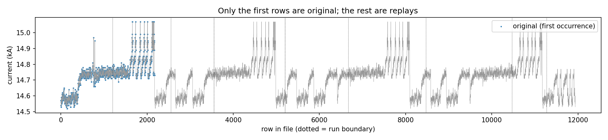
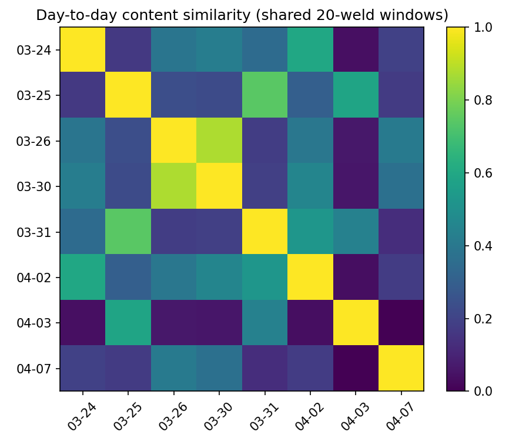
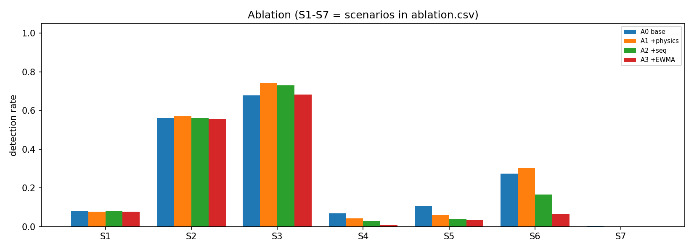

# 로봇용접 제조데이터 기반 용접 이상 탐지 및 안정 공정조건 분석

제6회 K-인공지능 제조데이터 분석 경진대회(KAMP) · 용접기 AI 데이터셋

> **요약**
> 데이터 무결성을 점검한 결과, 11,939타점 중 원본은 **2,175타점**뿐이고 나머지는 원본을 잘라 붙인 복제였다.
> 불량 라벨(일자별 개수)은 타점과 연결할 수 없으므로, **라벨 없이(비지도) 공정 이탈을 탐지**하고
> 성능은 **같은 오경보율에서의 합성 이탈 탐지율**로 검증했다.
> 최종 출력은 타점별 **위험 점수와 검사 우선순위**다.

---

## 1. 문제 정의

로봇 스폿용접에서는 가압력·전류·전압·통전시간의 변화로 파임, 용접부족, 크랙 등의 불량이 발생한다.
본 프로젝트의 목표는 다음 세 가지다.

1. 최종 검사 이전에 불량 위험을 탐지하는 AI 모델 개발
2. 불량 위험에 영향을 주는 조건과 모델의 실패조건 분석
3. 불량 위험을 낮추는 안정 공정조건 범위 제안

## 2. 데이터

| 시트 | 내용 | 규모 |
|---|---|---|
| `Raw data` | 타점별 공정변수 (Spot-01, 단일 품목) | 11,939타점 / 9일 |
| `result` | **일자별·유형별 불량 개수** (파임/용접부족/크랙) | 총 39건 (8일) |
| `data set` | 변수 설명 및 설비 수집 범위 | - |

- 타점 = 전극이 한 번 눌러 용접한 한 점 (데이터 1행)
- 두께 1·2는 전 구간 0.7 mm로 고정 → input은 **가압력, 전류, 전압, 통전시간 4개**
- 3/27은 `result`에 행이 없어 라벨 기반 분석에서 제외

## 3. 데이터 무결성 점검



### 3-1. 구간 단위 중복 제거

파일 순서대로 연속 20타점 구간을 훑으며, 이미 나온 구간이면 복제로 표시하고 **최초 등장 구간만 남겼다.**
행 단위로 지우면 측정 해상도(0.01 bar, 0.01 kA, 1 ms) 때문에 우연히 값이 같은 행까지 지워지지만,
구간 단위는 연속 패턴이 일치할 때만 복제로 판정하므로 이 문제가 없다.

### 3-2. 우연 일치가 아님을 검정

귀무모형: 날짜 안에서 행 순서만 섞은 데이터 (값·해상도·분포는 그대로).
해상도 때문에 우연히 같아지는 것이라면 섞은 데이터에서도 반복이 나와야 한다.

| 구간 길이 | 원본 데이터의 반복 구간 수 | 섞은 데이터의 반복 구간 수 |
|---|---|---|
| 3타점 | 11,685 | **0** |
| 20타점 | 11,600 | **0** |

→ **원본은 2,175타점** (3/24 전체 1,200 + 3/25 앞부분 975). 나머지 9,764타점은 이를 재조합한 것이다.

## 4. 불량 라벨을 쓸 수 없는 이유 (가설 B 검정)

가설 B: "일자별 불량 개수는 타점 데이터와 연결되어 있지 않다."



| 검정 | 결과 | 해석 |
|---|---|---|
| (a) 구조 | 라벨 있는 8일 중 **6일은 원본 타점이 0개**인데 불량 **27건(69%)** 기록 | 복제된 타점에 날짜별로 다른 불량이 붙어 있음 |
| (b) 동질성 (카이제곱) | p = 0.387 | 날짜별 불량 수 차이는 우연 변동(푸아송 노이즈) 범위 |
| (c) Mantel 검정 | ρ = 0.04, p = 0.53 | 타점 내용이 비슷한 날끼리도 불량률이 비슷하지 않음 |

→ 라벨은 **학습과 성능 검증에 사용하지 않는다.** 임의 라벨링 후 지도학습하는 방식은 근거가 없다.

## 5. 방법론

### 5-1. 탐지 모델

| 단계 | 방법 | 역할 |
|---|---|---|
| Stage 1 | Robust SPC (median / MAD, robust z > 6) | 큰 공정 이탈 탐지 + 이탈 변수 제시. IF 학습 데이터 오염 방지 |
| Stage 2 | Isolation Forest (1,000 trees) + 물리 파생변수 | 정상 구간에서의 미세 이상 탐지, 위험 점수 산출 |

물리 파생변수: 동저항 R = V/I [mΩ], 입열량 Q = V·I·t [J], I²t [kA²·ms]

- 학습: 원본 2,175타점 중 SPC 정상 구간
- 분할: 원본을 연속 10블록으로 나눠 3블록을 홀드아웃 (시계열 누수 방지)

### 5-2. 평가 기준: 같은 오경보율에서의 탐지율

모든 모델의 임계값을 **처음 보는 정상 데이터(홀드아웃)에서 오경보율 1%**가 되도록 맞춘 뒤,
인위적으로 주입한 이탈을 몇 % 잡는지 비교한다.

- 모든 타점을 이상으로 판정하면 탐지율은 100%가 된다. 따라서 탐지율은 오경보율과 함께 봐야만 의미가 있다.
- 오경보율 1% = "정상 제품 100개 중 1개를 재검사하는 비용"을 고정한다는 뜻이다. 같은 비용으로 어떤 모델이 더 많이 잡는지 비교한다.
- ROC 곡선에서 같은 FPR 지점의 TPR을 비교하는 것과 같다.
- 기준을 0.5% / 2% / 5%로 바꿔도 결론이 유지되는지 함께 확인했다.

합성 이탈 시나리오 (σ = 학습 정상 데이터의 표준편차):

| 시나리오 | 물리적 의미 |
|---|---|
| 가압력 +3σ | 과가압 → 파임 |
| 전류 −3σ / +3σ | 용접부족 / 과용접·크랙 |
| 전압 −3σ | 접촉불량 |
| 통전시간 −3σ | 용접부족 |
| 전류·전압·시간 각 −2σ 동시 | 복합 이상 (개별 변수로는 SPC 미탐지 수준) |
| 전류 −1.5σ 100타점 지속 | 점진적 드리프트 |

## 6. 결과

### 6-1. 알고리즘 비교 (홀드아웃 오경보율 1%)

| 알고리즘 | 특징 | 전류 과다 | 복합 이상 | 학습 임계값 그대로 쓸 때 오경보율 |
|---|---|---|---|---|
| **IF** | physics | **0.74** | 0.30 | **1.4%** |
| MCD | physics | 0.63 | 0.32 | 0.4% (base: 16%) |
| LOF | physics | 0.63 | 0.07 | 16.9% |

- 정상 구간에서 변수 간 상관이 거의 없어(|r| ≤ 0.08), IF의 약점(축 평행 분할)이 드러날 구조가 아니다.
- MCD·LOF는 타원형 분포를 가정하는데, 통전시간은 이산값이고 전류는 계단형으로 변해 오경보율이 불안정했다.

### 6-2. 실패조건 대안 Ablation



| 구성 | 점 이상 평균 탐지율 (FAR 0.5% / 1% / 2% / 5%) | 결과 |
|---|---|---|
| A0 기본 4변수 | 0.23 / 0.30 / 0.33 / 0.45 | 기준 |
| **A1 + 물리 변수** | **0.27 / 0.30 / 0.37 / 0.54** | 대부분 기준에서 최고 → **최종 채택** |
| A2 + 시퀀스 변수 | 0.23 / 0.27 / 0.39 / 0.52 | 2%에서만 근소 우위 |
| A3 + EWMA | 0.23 / 0.24 / 0.27 / 0.44 | 하락 |

- 물리 변수는 기존 변수의 계산값이라 새 정보는 없지만, 축 방향을 바꿔줘서 IF에 소폭 도움이 됐다.
- 드리프트 탐지율은 모든 구성에서 약 0%였다. 정상 운전 중 전류가 약 2σ 크기로 계단처럼 바뀌기 때문에, 비슷한 크기의 드리프트와 구분되지 않는다.

### 6-3. 시드 안정성 (Stage 2만)

| 지표 | IF | MCD |
|---|---|---|
| 점수 순위 상관 (Spearman) | **0.998** | 1.000 |
| 판정 일치도 (Jaccard) | 0.78 (최저 0.63) | 1.00 |

- 순위는 시드와 무관하게 거의 같다. 흔들리는 것은 1% 경계선 근처 몇 타점의 이진 판정뿐이다 (탐지 수 약 24개).
- 따라서 결과는 이진 판정보다 **위험 점수 순위**로 활용한다. 시드는 재현성을 위해 42로 고정했다.

### 6-4. SPC 임계값 trade-off

| z | 오경보율 | 전류 MDS | 가압력 MDS |
|---|---|---|---|
| 3 | 26.9% | 2.5σ | 4.0σ |
| 4 | 7.6% | 3.0σ | 5.0σ |
| 5 | 0.9% | 3.5σ | 5.5σ |
| **6 (채택)** | **0%** | 4.0σ | 6.5σ |

최소 탐지 변화량(MDS)은 모델의 능력이 아니라 임계값 선택의 결과다. 민감도와 오경보율은 trade-off 관계이므로,
모델 비교는 반드시 같은 오경보율에서 해야 한다.

## 7. 출력: 검사 우선순위

`scored_points.csv`는 전체 타점을 아래 순서로 정렬한다.

1. **SPC 이탈 타점** (robust z가 큰 순) — 즉시 점검 대상
2. **나머지 타점** (IF 위험 점수가 큰 순) — 재검사 우선순위

| 열 | 의미 |
|---|---|
| `priority` | 검사 우선순위 |
| `stage1_spc` / `stage2` | 각 단계 판정 |
| `max_robust_z` / `deviating_var` | 가장 크게 벗어난 정도와 그 변수 |
| `risk_score` / `risk_percentile` | IF 위험 점수와 백분위 |
| `original` | 원본 타점 여부 (False = 복제 타점) |

> 위험 점수는 **불량 확률이 아니라 정상 운전에서 벗어난 정도**다. 라벨이 타점과 연결되지 않아 불량 확률로 보정할 수 없다.

## 8. 안정 공정조건

원본 타점 중 이상으로 판정되지 않은 구간의 ±3σ:

| 변수 | 설비 수집 범위 | **정상 운전 범위 (±3σ)** |
|---|---|---|
| 가압력 (bar) | 1.0 ~ 12.0 | **2.18 ~ 2.48** |
| 전류 (kA) | 12.0 ~ 18.0 | **14.47 ~ 14.96** |
| 전압 (V) | 1.5 ~ 3.5 | **2.689 ~ 2.716** |
| 통전시간 (ms) | 30 ~ 120 | **69.9 ~ 73.6** |

| 주장 | 확신도 |
|---|---|
| 현재 공정의 정상 운전 범위(관리 한계)다 | 높음 |
| 이 범위 안이 밖보다 불량이 적다 | **검증 불가** (라벨 연결 불가) |
| 가압력 이탈(최대 10.5 bar)은 피해야 한다 | 중간 (과가압 → 파임의 물리적 근거) |

전류·전압·통전시간은 데이터 안에서 거의 변하지 않아, 이 범위 밖의 영향은 알 수 없다. 인과 검증에는 조건을 의도적으로 바꾸는 실험(DOE)이 필요하다.

## 9. 실패조건과 한계

1. **라벨 연결 불가**: 불량 39건 중 27건이 원본 타점이 없는 날에 기록됐다. 이전 버전(v2)의 "불량 56%가 설명되지 않음"은 모델의 실패가 아니라, 연결되지 않은 라벨을 설명하려 한 결과였다.
2. **공정의 비정상성**: 정상 운전 중 전류의 계단형 변화(약 2σ) 때문에 3σ 이하 이탈과 드리프트의 탐지율이 낮다.
3. **정보 한계**: 물리 파생변수는 기존 변수의 함수라 새 정보를 주지 못한다. 전극 팁 마모, 판재 간 틈, 표면 상태 등은 측정되지 않았다.
4. **데이터 규모**: 유효 데이터는 약 1.8일(2,175타점)이며 단일 설비·품목·두께다.

**향후 필요한 데이터**: 타점 단위 검사 결과, 전극 드레싱 이력, 동저항 파형, 복수 두께·품목 데이터

---

## 파일 구조

```
6th_KAMP/
├── README.md
├── requirements.txt
├── .gitignore
├── data/
│   └── Welding_Data_Set_01.xlsx        # 대회 데이터 (저장소에 올리지 않음)
├── src/
│   ├── welding_pipeline_v3.py          # 최종 파이프라인
│   └── archive/
│       ├── iforest_b_approach.py       # v1
│       └── welding_anomaly_pipeline.py # v2
└── results/                            # 아래 파일은 모두 실행 시 자동 생성
    ├── original_vs_replay.png          # 원본 vs 복제 구간
    ├── day_similarity.png              # 날짜 간 내용 유사도
    ├── ablation.png                    # 대안별 탐지율
    ├── integrity_by_day.csv            # 일자별 원본 타점 비율
    ├── chance_null.csv                 # 우연 일치 검정
    ├── hypothesis_b.csv                # 가설 B 검정 결과
    ├── day_similarity.csv
    ├── algo_comparison.csv             # 알고리즘 비교
    ├── ablation.csv                    # 대안 ablation
    ├── far_sensitivity.csv             # 기준 FAR별 결과
    ├── seed_stability.csv              # 시드 안정성
    ├── spc_tradeoff.csv                # SPC 임계값 trade-off
    ├── stable_window.csv               # 안정 공정조건
    └── scored_points.csv               # 검사 우선순위 (저장소에 올리지 않음)
```

## 실행 방법

```bash
pip install -r requirements.txt
python src/welding_pipeline_v3.py --data data/Welding_Data_Set_01.xlsx --out results
```

실행 시간은 약 5분이다 (합성 이탈 주입 반복과 순열검정 때문). 시드가 고정되어 있어 결과는 매번 같다.

## 개발 과정

| 버전 | 접근 | 결과와 교훈 |
|---|---|---|
| v1 | 단일 IF + 일자 불량률 상관 검증 | ρ = 0.355, p = 0.20. 이상이 가압력 이탈 블록에만 집중 |
| v2 | 행 단위 중복 제거 + SPC/IF 2단계 + 합성 주입 검증 | 중복 누수로 오경보율 과소평가(0.2% → 4.5%) 발견. 시드 안정성이 SPC 때문에 과대평가됨 |
| v3 | 구간 단위 중복 제거 + 가설 B 검정 + 같은 FAR 비교 + ablation | 원본 2,175타점 확인, 라벨 연결 불가 입증, IF + 물리 변수 채택 |
