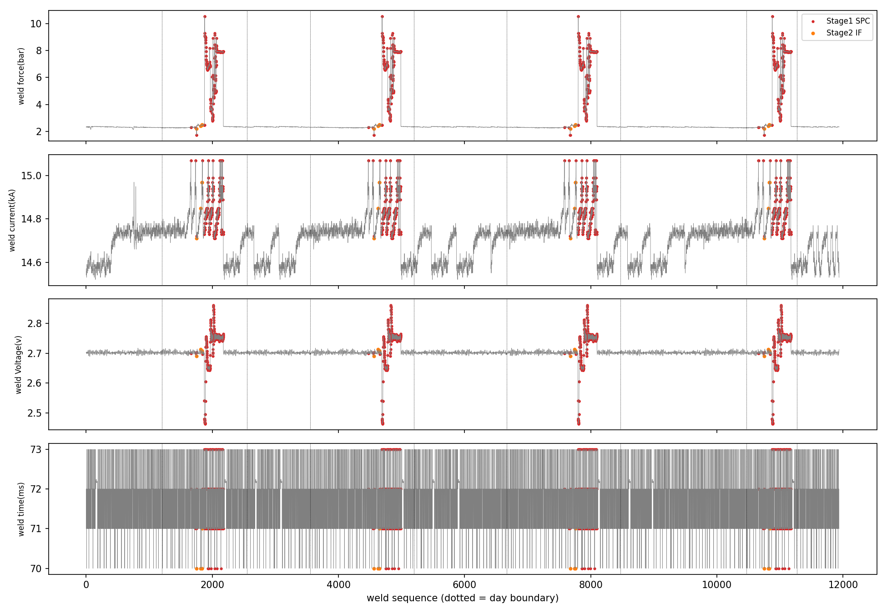
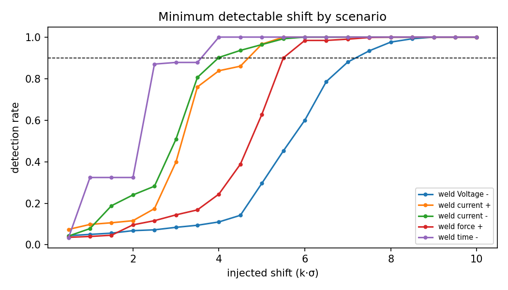
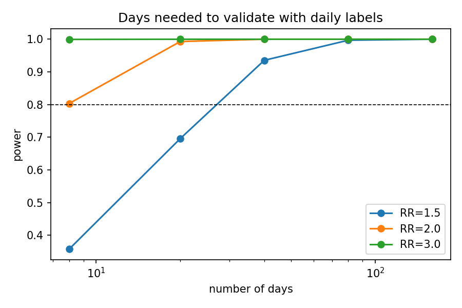

# 로봇용접 제조데이터 기반 용접불량 위험 탐지 및 안정 공정조건 분석

제6회 K-인공지능 제조데이터 분석 경진대회(KAMP) · 용접기 AI 데이터셋

> **요약**
> 타점 단위 라벨이 없고 일자 단위 라벨은 통계적 신호가 없으므로,
> **라벨 없이(비지도) 공정 이탈을 탐지**하고 탐지 성능은 **합성 이탈 주입으로 검증**했다.

---

## 1. 문제 정의

로봇 스폿용접에서는 가압력·전류·전압·통전시간의 변화로 파임, 용접부족, 크랙 등의 불량이 발생한다.
본 프로젝트의 목표는 다음 세 가지다.

1. 최종 검사 이전에 불량 위험을 탐지하는 AI 모델 개발
2. 불량에 영향을 주는 주요 조건과 모델의 실패조건 분석
3. 불량 위험을 낮추는 안정 공정조건 범위 제안

## 2. 데이터 특성과 접근 방식 선택

| 시트 | 내용 | 규모 |
|---|---|---|
| `Raw data` | 타점별 공정변수 (Spot-01, 단일 품목) | 11,939타점 / 9일 |
| `result` | **일자별·유형별 불량 개수** (파임/용접부족/크랙) | 23행, 총 39건 |
| `data set` | 변수 설명 및 설비 수집 범위 | - |

- 두께 1·2는 전 구간 0.7 mm로 고정이다. 따라서 input은 **가압력, 전류, 전압, 통전시간 4개**다.
- 3/27은 생산 기록은 있으나 `result`에 행이 없다. 누락 여부가 불명확하므로 라벨 기반 분석에서 제외했다.

### 왜 지도학습(임의 라벨링)이 아닌 비지도 학습인가

| 근거 | 내용 |
|---|---|
| ① 타점 라벨 부재 | 일자별 불량 3~8건을 특정 타점에 배정할 근거가 없다. 임의 라벨링은 오류를 학습에 주입한다. |
| ② 일자 라벨에 신호 없음 | 카이제곱 동질성 검정 결과 **p = 0.387**. 날짜별 불량 수 차이는 우연 변동(푸아송 노이즈)과 구분되지 않는다. |
| ③ 검정력 부족 | 이탈일 불량률이 1.5배 높아도 8일로 검출할 확률은 **36%**다. 약 40일이 필요하다. |
| ④ 데이터 복제 흔적 | 타점의 **98%**가 다른 위치에서 반복되는 20타점 연속 구간에 속한다. 가압력 이탈 블록 291타점은 4일에 걸쳐 완전히 동일하다. 일자 라벨과 타점의 물리적 연결을 가정할 수 없다. |

→ 일자 라벨은 **학습·주 검증에 사용하지 않고**, 결과와 모순되지 않는지 확인하는 보조 지표로만 사용한다.

## 3. 방법론



### 2단계 탐지 모델 (`TwoStageDetector`)

| 단계 | 방법 | 역할 |
|---|---|---|
| Stage 1 | Robust SPC (median / MAD, robust z > 6) | 큰 공정 이탈 탐지, 원인 변수 제시 (해석 가능) |
| Stage 2 | Isolation Forest (Stage 1 정상 구간으로만 학습) | 개별 변수는 정상이지만 조합이 비정상인 미세 이상 탐지 |

- 라벨은 어디에도 사용하지 않는다.
- 학습과 홀드아웃은 **중복 행을 제거한 뒤** 수행한다. 중복이 train/test 양쪽에 들어가는 누수를 막기 위해서다.

### 라벨 독립 검증

| 검증 | 방법 |
|---|---|
| 오경보율 | 정상 구간 고유 행을 7:3으로 분할해 홀드아웃에서 측정 |
| 최소 탐지 변화량(MDS) | 홀드아웃 정상 타점에 시나리오별 kσ 이탈을 주입하고, 탐지율 90%에 도달하는 최소 k를 산출 |
| 시드 안정성 | random_state 20회, 기준 대비 Jaccard 일치도 |
| 약라벨 일관성 | 이탈일 vs 비이탈일 불량 비율 (조건부 이항검정) |

## 4. 주요 결과

### 탐지 성능

| 항목 | 결과 |
|---|---|
| Stage 1 이탈 | 1,240타점 (원인: 가압력 1,196 / 전류 24 / 전압 20) |
| Stage 2 미세 이상 | 16타점 |
| 홀드아웃 오경보율 (중복 제거) | 4.5% |
| 시드 안정성 | Jaccard 평균 0.998 |

> 중복을 제거하기 전 오경보율은 0.2%로 측정됐다. 이는 누수로 인해 낙관적으로 나온 값이며, 중복 데이터가 검증을 왜곡할 수 있음을 보여준다.

### 최소 탐지 변화량 (탐지율 90%)



| 시나리오 | 물리적 의미 | MDS |
|---|---|---|
| 가압력 ↑ | 과가압 → 파임 | +0.30 bar (5.5σ) |
| 전류 ↓ | 용접부족 | −0.35 kA (4.0σ) |
| 전류 ↑ | 과용접 / 크랙 | +0.44 kA (5.0σ) |
| 전압 ↓ | 접촉불량 | −0.034 V (7.5σ) |
| 통전시간 ↓ | 용접부족 | −2.8 ms (4.0σ) |

### 약라벨 일관성

- 이탈일의 불량률은 0.43%, 비이탈일은 0.35%로 방향은 일치한다.
- 다만 p = 0.31로 유의하지는 않다. 이는 3장의 검정력 한계와 일치하며, 결과와 모순되지 않는다.



## 5. 실패조건 분석

1. **측정되지 않는 요인에 의한 불량**
   전체 불량 39건 중 22건(56%)이 공정 이탈이 없는 날 발생했다. 전극 마모, 표면 상태, 소재 편차 등 수집되지 않은 요인이 원인일 가능성이 높으며, 이런 불량은 4개 변수만으로는 원리적으로 탐지할 수 없다.
2. **탐지 한계 이하의 작은 변화**
   위 MDS보다 작은 변화는 놓친다. 특히 전압은 7.5σ 이상 벗어나야 탐지되므로 가장 둔감하다.
3. **데이터 대표성**
   단일 설비·단일 품목·단일 두께(0.7 mm) 데이터이므로, 다른 조건으로 일반화하려면 재학습이 필요하다.

## 6. 안정 공정조건 제안

이상으로 판정된 타점을 제외한 정상 운전 구간의 ±3σ를 기준으로 했다.

| 변수 | 설비 수집 범위 | **안정 범위 (±3σ)** | 이탈 구간 중앙값 |
|---|---|---|---|
| 가압력 (bar) | 1.0 ~ 12.0 | **2.21 ~ 2.46** | 7.29 |
| 전류 (kA) | 12.0 ~ 18.0 | **14.44 ~ 14.96** | 14.83 |
| 전압 (V) | 1.5 ~ 3.5 | **2.689 ~ 2.715** | 2.749 |
| 통전시간 (ms) | 30 ~ 120 | **70 ~ 73** | 72 |

- 가장 큰 위험 요인은 **가압력 이탈**이다. 정상 대비 약 3배(최대 10.5 bar)까지 상승하며, 물리적으로 전극 압흔(파임불량)과 연결된다.
- 운영 시에는 Stage 1 규칙을 실시간 SPC 알람으로 쓰고, Stage 2 점수는 추가 점검 우선순위로 활용할 수 있다.

## 7. 한계 및 향후 과제

- 일자 라벨의 통계적 신호가 약해, 불량 예측 성능을 직접 증명하지는 못한다. 본 모델은 **"불량 위험 = 공정 이탈"을 탐지하는 모델**로 해석해야 한다.
- 타점 단위 검사 결과 또는 40일 이상의 데이터가 확보되면 불량 예측 성능을 직접 검증할 수 있다.
- 전극 교체 이력, 타점 위치 등 추가 변수가 확보되면 5장의 실패조건 ①을 줄일 수 있다.

---

## 파일 구조

```
6th_KAMP/
├── README.md
├── requirements.txt
├── .gitignore
├── data/
│   └── Welding_Data_Set_01.xlsx      # 대회 데이터 (저장소에 올리지 않음)
├── src/
│   ├── welding_anomaly_pipeline.py   # 최종 파이프라인
│   └── iforest_b_approach.py         # 초기 실험 (단일 IF + 일자 상관 검증)
└── results/
    ├── timeline.png                  # 타점 시계열 + 탐지 결과
    ├── mds_curves.png                # 시나리오별 탐지율 곡선
    ├── power_analysis.png            # 필요 일수 검정력 분석
    ├── daily_table.csv               # 일자별 탐지·불량 집계
    ├── mds.csv                       # 최소 탐지 변화량
    ├── mds_curves.csv
    ├── power_analysis.csv
    ├── stable_window.csv             # 안정 공정조건 범위
    └── scored_points.csv             # 타점별 판정·점수·원인 변수
```

## 실행 방법

```bash
pip install -r requirements.txt
python src/welding_anomaly_pipeline.py --data data/Welding_Data_Set_01.xlsx --out results
```

실행하면 콘솔에 단계별 결과가 출력되고, 표와 그래프가 `results/`에 저장된다.

## 개발 과정

| 버전 | 파일 | 접근 | 결과 |
|---|---|---|---|
| v1 | `iforest_b_approach.py` | 단일 Isolation Forest, 일자 불량률과의 상관으로 검증 | ρ = 0.355, p = 0.20. 탐지된 이상은 전부 가압력 이탈 블록에 집중 |
| v2 | `welding_anomaly_pipeline.py` | 무결성 점검, 2단계 탐지, 라벨 독립 검증 | 검증 방식 전환, 실패조건·안정범위 도출 |
